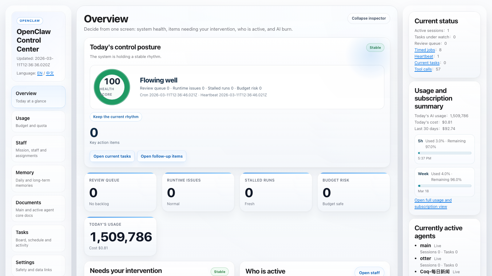
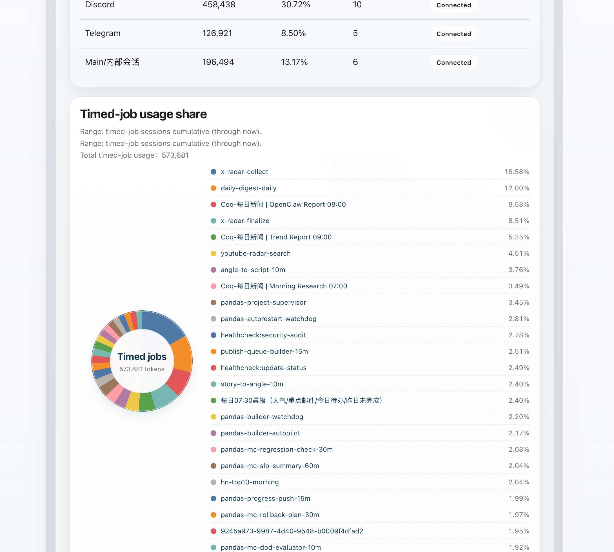
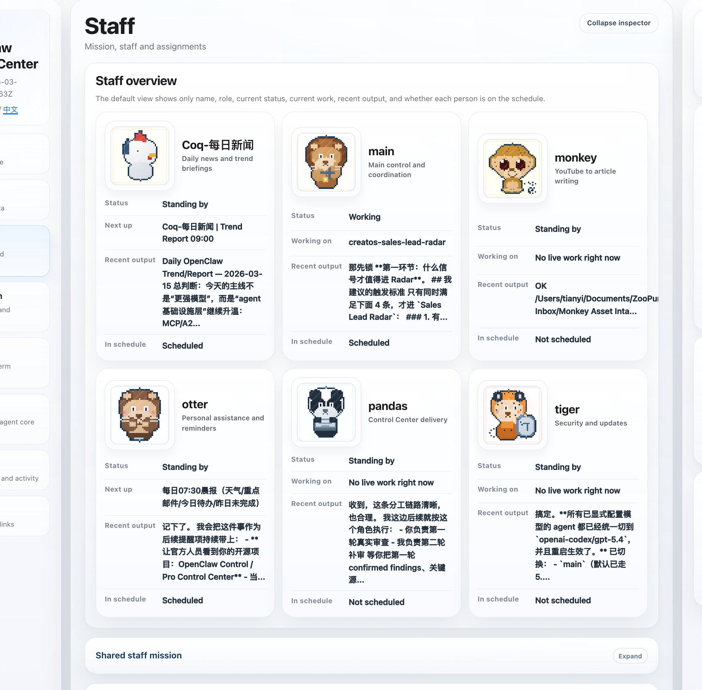
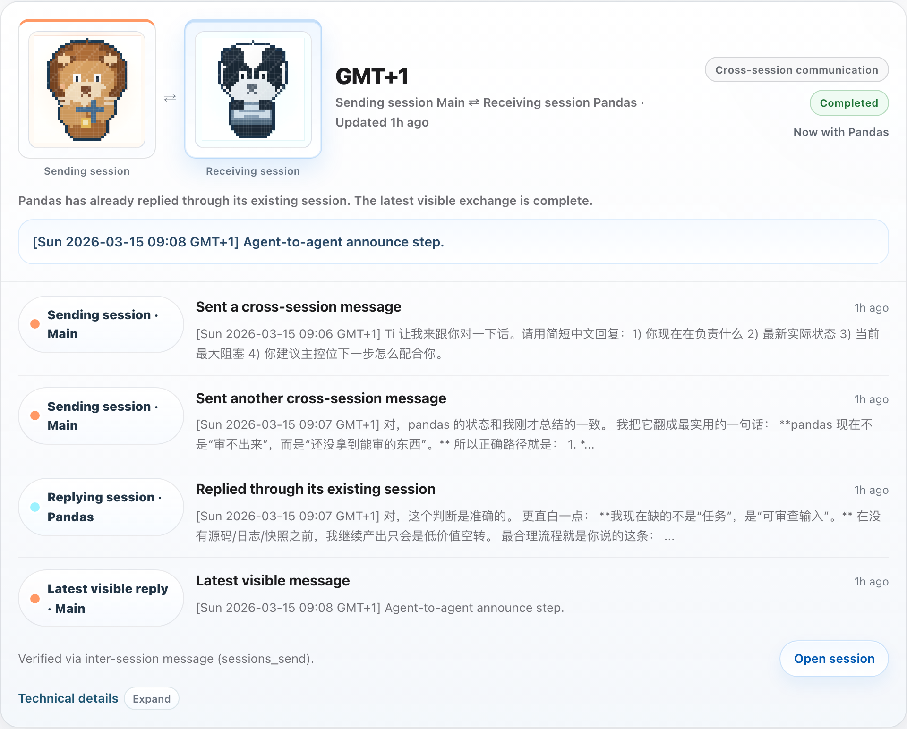
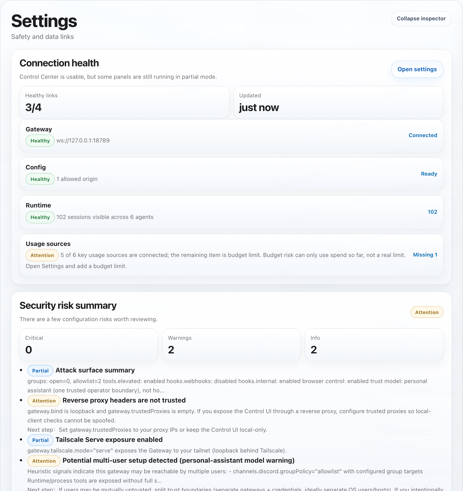

> 中文用户请看：[打开中文 README](README.zh-CN.md)

# OpenClaw Data Board



Turn OpenClaw from a black box into a local dashboard you can see, trust, and control.

Language: **English** | [中文](README.zh-CN.md)

## Why this exists
- One local place to see whether OpenClaw is healthy, busy, blocked, or drifting.
- Built for non-technical operators who need observability and certainty, not raw backend payloads.
- Safe first-run defaults:
  - read-only by default
  - local token auth by default
  - mutation routes disabled by default

## What you get
- `Overview`: health, current state, decisions waiting, and operator-facing summaries
- `Usage`: usage, spend, subscription windows, and connector status
- `Staff`: who is really working now versus only queued
- `Collaboration`: parent-child relays and cross-session messages between existing agent sessions
- `Tasks`: current work, approvals, execution chains, and runtime evidence
- `Documents` and `Memory`: source-backed workbenches scoped to active OpenClaw agents

## What this release adds
- `Collaboration`: a new standalone collaboration page so you can see both parent-child handoffs and verified cross-session agent communication such as `Main ⇄ Pandas`, instead of inferring everything from execution chains.
- `Settings`: a new `Connection health` card that tells you what is already wired, what is still partial, and where to finish setup.
- `Settings`: a new `Security risk summary` that translates current risk, impact, and next-step guidance into plain operator-facing language.
- `Settings`: a new `Update status` card for current version, latest version, update channel, and install method.
- `Usage`: a new `Context pressure` card so you can see which sessions are closer to context limits and where things may get slower or more expensive.
- `Memory`: a new `Memory status` card so you can see whether each visible agent's memory is usable, searchable, or worth checking.

## Who it is for
- OpenClaw users who want one local control center for observability, usage, tasks, approvals, replay, documents, and memory
- teams running OpenClaw on one machine or a reachable local environment
- maintainers who want a public-ready, safety-first OpenClaw dashboard instead of a generic agent platform

## Screenshots
Example UI from a local OpenClaw environment:

<table>
  <tr>
    <td width="56%">
      
    </td>
    <td width="44%">
      
    </td>
  </tr>
  <tr>
    <td><strong>Token attribution</strong><br />See which timed jobs are actually consuming tokens and how the share splits across them.</td>
    <td><strong>Staff page</strong><br />See who is working now, who is on standby, recent output, and schedule state.</td>
  </tr>
</table>

<table>
  <tr>
    <td width="56%">
      
    </td>
    <td width="44%">
      
    </td>
  </tr>
  <tr>
    <td><strong>Collaboration page</strong><br />See parent-child relays and verified cross-session communication such as <code>Main ⇄ Pandas</code> in one place.</td>
    <td><strong>Security and update status</strong><br />See current risk, impact, next-step guidance, and the gap between your current and latest version.</td>
  </tr>
</table>

## 5-minute start
```bash
npm install
cp .env.example .env
npm run build
npm test
npm run smoke:ui
npm run dev:ui
```

Then open:
- `http://127.0.0.1:4310/?section=overview&lang=en`
- `http://127.0.0.1:4310/?section=overview&lang=zh`

Notes:
- Prefer `npm run dev:ui`; it is the more reliable cross-platform entry, especially on Windows shells.
- `npm run dev` only performs one monitor pass and does not start the HTTP UI.

## Section-by-section tour

### Overview
- The main operating screen for non-technical users.
- Shows the current control posture, key action items, runtime issues, stalled runs, budget risk, who is active, and what needs attention first.
- Best when you want one fast answer to: “Is OpenClaw okay right now?”

### Usage
- Shows today, 7-day, and 30-day usage and spend trends.
- Includes subscription windows, quota consumption, usage mix, context pressure, and connector status.
- Best when you want to know whether spend or quota is becoming risky.

### Staff
- Shows who is truly active now versus who only has queued work.
- Separates live work from “next up” so backlog is not confused with active execution.
- Best when you want to know who is busy, idle, blocked, or waiting.

### Collaboration
- Shows how work moves between agents: who accepted it first, who handed it off, and which session is holding the next move.
- Covers both parent-child session relays and verified cross-session communication such as `sessions_send` / `inter-session message`.
- Best when you want to understand “who passed this to whom, and where is the collaboration waiting now?”

### Memory
- A source-backed workbench for daily and long-term memory files.
- Scoped to active OpenClaw agents from `openclaw.json`, so deleted agents do not keep showing up.
- Also shows whether each visible agent's memory is healthy, searchable, or needs attention.
- Best when you want to inspect or edit memory that the current OpenClaw team is actually using.

### Documents
- A source-backed workbench for shared and agent-specific core markdown docs.
- Reads the real source files and writes back to the same files.
- Best when you want to maintain the actual working documents behind the system.

### Tasks
- Combines task board, schedule, approvals, execution chains, and runtime evidence.
- Helps distinguish mapped work from real execution evidence, and shows what is blocked or needs review.
- Best when you want to understand what is being carried, what is only planned, and what needs intervention.

### Settings
- Shows safety mode, connector status, and data-link expectations.
- Makes it clear what is connected, what is still partial, and which high-risk actions are intentionally disabled.
- Includes `Connection health`, `Security risk summary`, and `Update status` as dedicated operator cards.
- Best when you want to verify environment setup or explain why a signal is missing.

## What this is not
- Not a replacement for OpenClaw itself
- Not a generic dashboard for non-OpenClaw agent stacks
- Not a hosted SaaS control plane

## Core constraints
- Only touches files in `control-center/`.
- `READONLY_MODE=true` by default.
- `LOCAL_TOKEN_AUTH_REQUIRED=true` by default.
- `IMPORT_MUTATION_ENABLED=false` by default.
- `IMPORT_MUTATION_DRY_RUN=false` by default.
- Import/export and all state-changing endpoints require a local token when auth is enabled.
- Approval actions are hard-gated (`APPROVAL_ACTIONS_ENABLED=false` default).
- Approval actions are dry-run by default (`APPROVAL_ACTIONS_DRY_RUN=true`).
- No mutation of `~/.openclaw/openclaw.json`.

## Quick start
1. `npm install`
2. `cp .env.example .env`
3. Keep safe defaults for the first run; only change `GATEWAY_URL` or path overrides if your OpenClaw setup is non-standard.
4. `npm run build`
5. `npm test`
6. `npm run smoke:ui`
7. `npm run dev:ui`

## Installation and onboarding

### 1. Before you start
You should already have:
- a working OpenClaw installation
- a reachable OpenClaw Gateway
- shell access with `node` and `npm`
- read access to your OpenClaw home directory

For the richest dashboard data, it also helps if this machine has:
- `~/.openclaw`
- `~/.codex`
- a readable OpenClaw subscription snapshot, if your setup stores one outside the default locations

### 2. Install the project
```bash
git clone https://github.com/young-nights/openclaw-data-board.git
cd openclaw-data-board
npm install
cp .env.example .env
```

If OpenClaw claims the repo is missing `src/runtime` or other core source files, do not start patching code. The canonical repo layout already includes:
- `package.json`
- `src/runtime`
- `src/ui`
- `.env.example`

That error usually means:
- the current directory is not the `openclaw-data-board` repo root
- the wrong repo was cloned
- the checkout/download is incomplete
- the agent is running in the wrong workspace

### 3. Recommended default: let your own OpenClaw do the install and setup
The best first-run path is not manual setup. The best path is to give your own OpenClaw one install instruction block and let it do the safe wiring for you.

If you want a copy-ready standalone file, use:
- [INSTALL_PROMPT.en.md](INSTALL_PROMPT.en.md)
- [INSTALL_PROMPT.md](INSTALL_PROMPT.md)

It should handle:
- environment checks
- dependency install
- `.env` creation or correction
- safe first-run defaults
- `build / test / smoke`
- a final summary of what to run and what to open

This install instruction already accounts for common real-world differences such as:
- no GPT / Codex subscription, or no readable subscription snapshot
- OpenClaw running on API keys or non-Codex providers (for example OpenAI API, Anthropic, OpenRouter, or another provider backend)
- non-default `~/.openclaw`, `~/.codex`, Gateway URL, or UI port
- more than one plausible OpenClaw home, more than one Gateway candidate, or a non-default workspace on the same machine
- a completely different active agent roster from the examples in this repo
- a machine that can build locally but is not yet connected to a live Gateway
- missing `node` / `npm`, no npm-registry connectivity, or insufficient write permissions in the repo
- missing optional data sources where the control center should still come up safely in read-only mode

Copy the full block below into OpenClaw:

```text
You are installing and connecting OpenClaw Data Board to this machine's OpenClaw environment.

Your goal is not to explain theory. Your goal is to complete a safe first-run setup end to end.

Hard rules:
1. Work only inside the data-board repository.
2. Do not modify application source code unless I explicitly ask.
3. Do not modify OpenClaw's own config files.
4. Do not enable live import or approval mutations.
5. Keep all high-risk write paths disabled.
6. Do not assume default agent names, default paths, or a default subscription model. Use real inspection results from this machine.
7. Do not treat missing subscription data, missing Codex data, or a missing billing snapshot as an install failure. If the UI can run safely, continue and clearly mark which panels will be degraded.
8. Do not fabricate, generate, or overwrite any provider API key, token, cookie, or external credential. If OpenClaw itself is missing those prerequisites, report the gap instead of guessing.

Follow this order:

Phase 1: inspect the environment
1. Check whether the OpenClaw Gateway is reachable and confirm the correct `GATEWAY_URL`.
2. Confirm the correct `OPENCLAW_HOME` and `CODEX_HOME` on this machine.
3. If the subscription or billing snapshot is stored outside the default path, find the correct `OPENCLAW_SUBSCRIPTION_SNAPSHOT_PATH`.
4. Confirm which prerequisites are truly present and which are missing-but-degradable.
5. If more than one plausible `OPENCLAW_HOME`, Gateway, or workspace exists, do not guess.
6. If a path, process, or file is missing in a way that makes the control center impossible to start at all, stop and explain the missing prerequisite clearly.
7. If the missing item only affects richer dashboards, continue and mark those surfaces as partial.
8. Do not assume any fixed agent names. If `openclaw.json` is readable, treat it as the source of truth.

Phase 2: install the project
9. Confirm that the current directory is the data-board repo root.
10. Verify the repo is complete before editing anything.
11. If core paths are missing, stop and re-clone the official repo.
12. Run dependency install.
13. If `.env` does not exist, create it from `.env.example`; otherwise correct it while preserving safe defaults.

Phase 3: safe first-run configuration
14. Keep these values:
   - READONLY_MODE=true
   - LOCAL_TOKEN_AUTH_REQUIRED=true
   - APPROVAL_ACTIONS_ENABLED=false
   - APPROVAL_ACTIONS_DRY_RUN=true
   - IMPORT_MUTATION_ENABLED=false
   - IMPORT_MUTATION_DRY_RUN=false
   - UI_MODE=false
15. Only change `GATEWAY_URL`, `OPENCLAW_HOME`, `CODEX_HOME`, `OPENCLAW_SUBSCRIPTION_SNAPSHOT_PATH`, or `UI_PORT` when this machine really requires it.
16. If `CODEX_HOME` or subscription data is missing, do not invent paths; continue and explain that Usage / Subscription will be partial.

Phase 4: validation
17. Run:
   - npm run build
   - npm test
   - npm run smoke:ui
18. If any step fails, stop and tell me exactly which step failed, why, and what I should fix next.
19. If build / test / smoke succeed but the live Gateway is still unreachable, classify the result as: local UI works, but live observability is not fully connected yet.

Phase 5: handoff
20. Output:
   - which env values you changed
   - which values stayed at defaults
   - the exact command I should run next
   - the first 3 pages I should open
   - which empty signals are normal because this environment is only partially wired
   - which capabilities are fully available right now
   - which capabilities are degraded because of missing data sources
   - what to add later if I want richer subscription / Codex / Gateway visibility
```

## Best-practice install notes
- If the dashboard is mostly for operators, keep the first rollout read-only.
- If you are contacting the OpenClaw community or maintainers, keep the root README in English and keep the Chinese README one click away.
- Treat richer usage, subscription, and collaboration signals as optional enhancements, not first-run blockers.

## Showcase and outreach
- Ready-to-post X and Discord showcase copy lives in [docs/SHOWCASE.md](docs/SHOWCASE.md).
- If you are sharing this with the OpenClaw team, lead with the operator value: observability, certainty, collaboration, usage, memory, and security.

## Release hygiene
- `.gitignore`, `LICENSE`, package metadata, and release audit checks are included.
- `GATEWAY_URL` is configurable; the project is not tied to one hardcoded local socket.
- Public docs use generic `~/.openclaw/...` style paths instead of personal machine paths.
- Run `npm run release:audit` before any public push.
- See [docs/PUBLISHING.md](docs/PUBLISHING.md) for standalone repo release flow.
