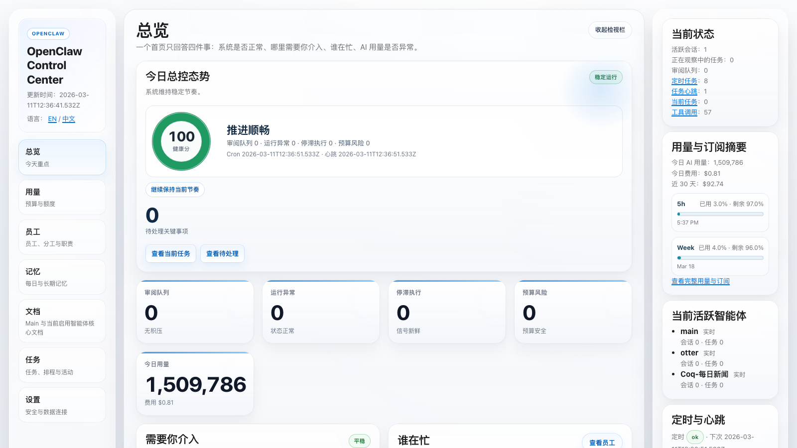
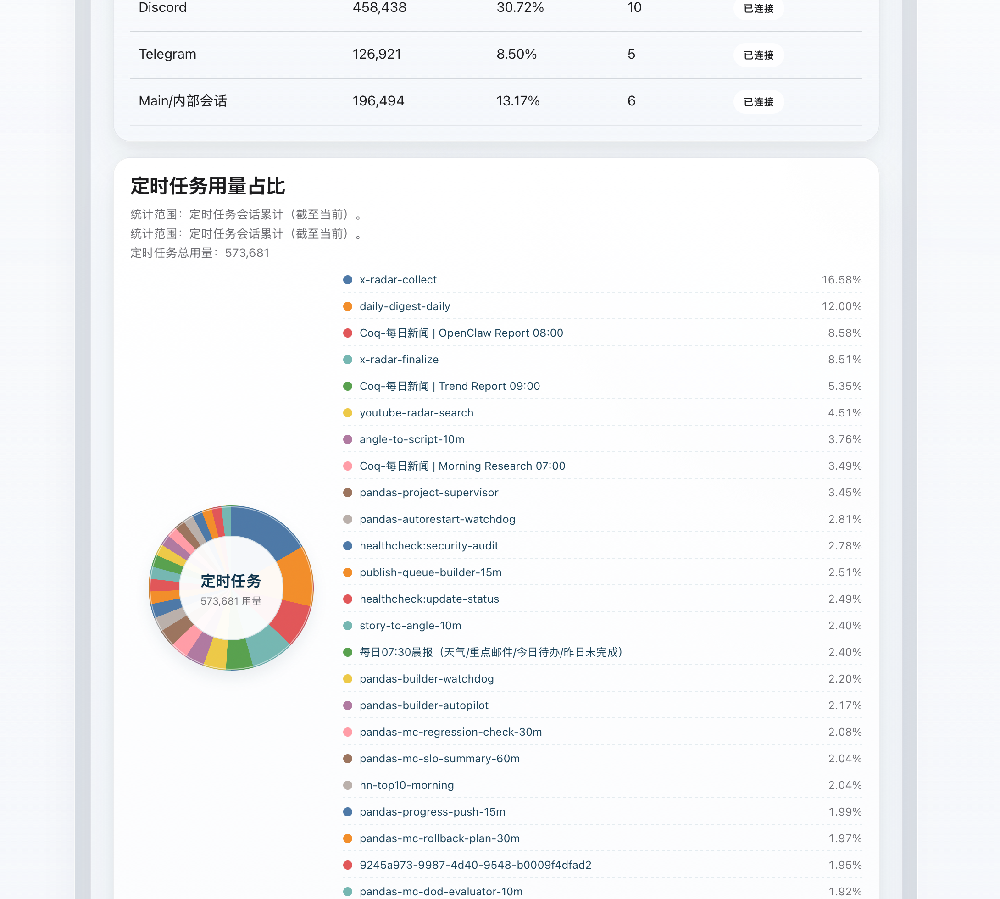
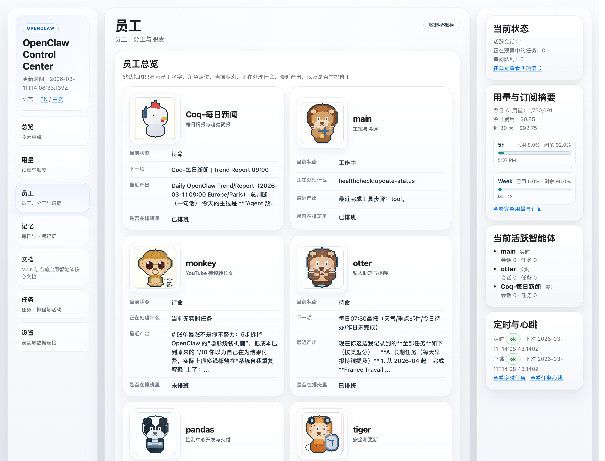
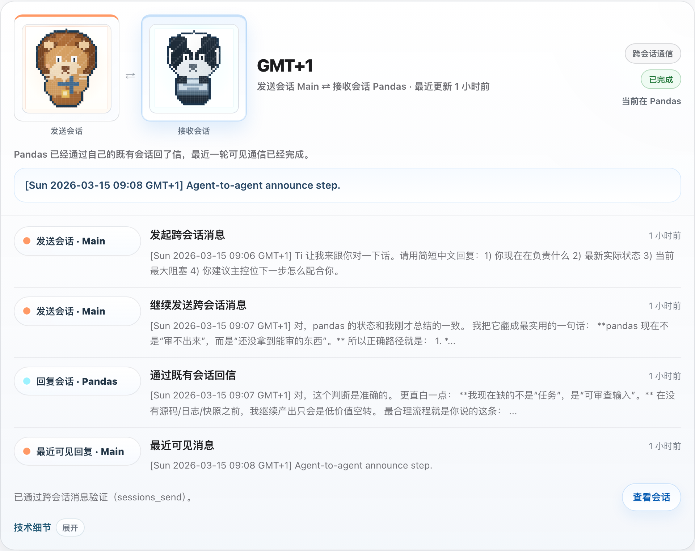
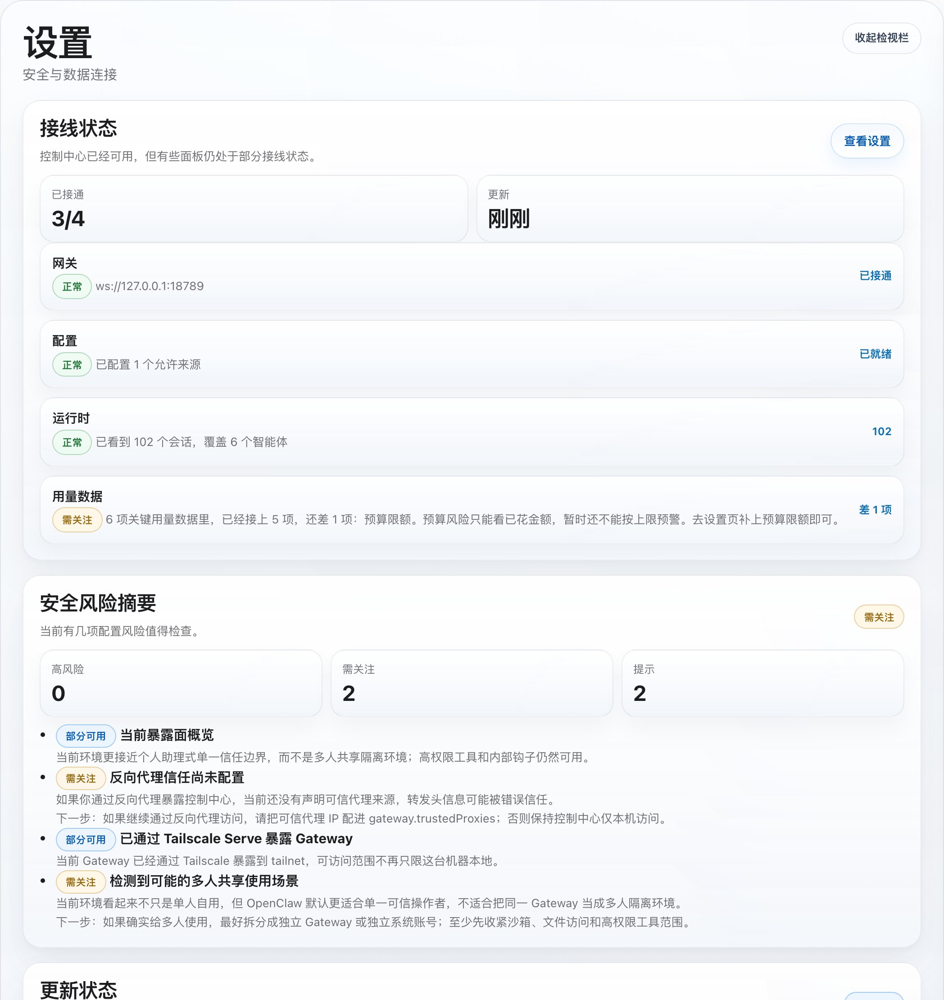

> Looking for English? Start here: [Open the English README](README.en.md)

# OpenClaw Control Center



OpenClaw 的安全优先、本地优先控制中心。

语言： [English](README.en.md) | **中文**

## 这个项目是做什么的
- 给 OpenClaw 提供一个本地控制中心，集中看系统是否稳定、谁在工作、哪些任务卡住了、今天花了多少。
- 面向非技术用户，重点是“看得懂、看得准”，不是暴露原始后端 payload。
- 首次接入默认安全：
  - 默认只读
  - 默认本地 token 鉴权
  - 默认关闭高风险写操作

## 你能得到什么
- `总览`：系统状态、待处理事项、关键风险和运营摘要
- `用量`：用量、花费、订阅窗口和连接状态
- `员工`：谁真的在工作，谁只是排队待命
- `协作`：父子会话接力与智能体之间的跨会话通信
- `任务`：当前任务、审批、执行链和运行证据
- `文档` 与 `记忆`：按活跃 OpenClaw agent 范围展示的源文件工作台

## 这个版本新增了什么
- `协作`：新增独立 `协作` 页面，直接看父子会话接力和 `Main ⇄ Pandas` 这种已验证跨会话通信，不再只看执行链猜关系。
- `设置`：新增 `接线状态`，直接告诉你哪些数据已经接好、哪些还差一步，以及该去哪里补。
- `设置`：新增 `安全风险摘要`，把当前风险、影响和下一步建议翻译成人话。
- `设置`：新增 `更新状态`，直接看当前版本、最新版本、更新通道和安装方式。
- `用量`：新增 `上下文压力`，直接看哪些会话更接近上下文上限，哪里可能变慢或变贵。
- `记忆`：新增 `记忆状态`，直接看每个智能体的记忆是否可用、可搜索、需不需要检查。

## 适合谁
- 已经在用 OpenClaw、想要一个统一控制中心的团队或个人
- 在同一台机器或可达本地环境里运行 OpenClaw 的使用者
- 想公开发布一个安全优先的 OpenClaw 控制台，而不是做通用 agent 平台的人

## 截图
以下截图来自一个本地 OpenClaw 环境：

<table>
  <tr>
    <td width="56%">
      
    </td>
    <td width="44%">
      
    </td>
  </tr>
  <tr>
    <td><strong>Token 消耗归因</strong><br />直接看定时任务 token 是被哪些任务吃掉的，占比一眼可见。</td>
    <td><strong>员工页</strong><br />直接看谁在工作、谁待命、最近产出和排班状态。</td>
  </tr>
</table>

<table>
  <tr>
    <td width="56%">
      
    </td>
    <td width="44%">
      
    </td>
  </tr>
  <tr>
    <td><strong>协作页</strong><br />直接看父子会话接力，以及像 <code>Main ⇄ Pandas</code> 这样的已验证跨会话通信。</td>
    <td><strong>安全与更新状态</strong><br />直接看当前风险、影响、下一步建议，以及当前版本和最新版本。</td>
  </tr>
</table>

## 5 分钟启动
```bash
npm install
cp .env.example .env
npm run build
npm test
npm run smoke:ui
npm run dev:ui
```

然后打开：
- `http://127.0.0.1:4310/?section=overview&lang=zh`
- `http://127.0.0.1:4310/?section=overview&lang=en`

说明：
- 推荐用 `npm run dev:ui` 启动界面；它比 `UI_MODE=true npm run dev` 更稳，尤其是 Windows shell。
- `npm run dev` 只会执行一次 monitor，不会启动 HTTP UI。

## 分区功能说明

### 总览
- 给非技术用户看的主操作页。
- 集中展示当前总控态势、待处理事项、运行异常、停滞执行、预算风险、谁在忙、哪些地方需要优先关注。
- 最适合快速回答一句话：`OpenClaw 现在整体正常吗？`

### 用量
- 展示今日、7 天、30 天的用量和花费趋势。
- 包含订阅窗口、配额消耗、用量结构、上下文压力和数据连接状态。
- 最适合判断花费或额度是否开始有风险。

### 员工
- 展示谁现在真的在工作，谁只是有排队中的任务。
- 明确区分“正在执行”和“下一项”，避免把 backlog 误认为正在跑。
- 最适合判断谁忙、谁闲、谁卡住、谁在等待。

### 协作
- 独立展示智能体之间怎么交接、谁先接单、谁派给了谁、回复从哪条会话回来。
- 既能看父会话与子会话的接力，也能看 `sessions_send` / `inter-session message` 这类已验证跨会话通信。
- 最适合理解“这件事到底是谁转给了谁、现在卡在谁这里”。

### 记忆
- 一个直接基于源文件的记忆工作台，用来查看和编辑每日记忆与长期记忆。
- 范围跟随 `openclaw.json` 里的活跃 agent，不会把已删除 agent 继续显示出来。
- 现在还会直接告诉你每个智能体的记忆是否正常、可搜索、是否需要检查。
- 最适合查看或维护当前 OpenClaw 团队真实在用的记忆内容。

### 文档
- 一个直接基于源文件的文档工作台，用来查看和编辑共享文档与 agent 核心文档。
- 打开的是实际源文件，保存后也直接写回同一个源文件。
- 最适合维护系统背后真正生效的工作文档。

### 任务
- 把任务板、排期、审批、执行链和运行证据放在同一个分区里。
- 能帮助区分哪些只是看板映射，哪些已经有真实执行证据，哪些任务卡住了、需要跟进或待审。
- 最适合理解“现在到底在做什么、只是计划了什么、哪些需要你介入”。

### 设置
- 展示安全模式、连接器状态和数据链路预期。
- 会明确告诉你哪些数据已经接上，哪些还只是部分可见，哪些高风险动作是故意关闭的。
- 现在还包含 `接线状态`、`安全风险摘要` 和 `更新状态` 三张关键卡片。
- 最适合排查环境配置、解释为什么某些信号缺失。

## 核心约束
- 只修改 `control-center/` 目录内的文件
- 默认 `READONLY_MODE=true`
- 默认 `LOCAL_TOKEN_AUTH_REQUIRED=true`
- 默认 `IMPORT_MUTATION_ENABLED=false`
- 默认 `IMPORT_MUTATION_DRY_RUN=false`
- 开启鉴权时，导入/导出和所有改状态接口都需要本地 token
- 审批动作有硬开关，默认关闭：`APPROVAL_ACTIONS_ENABLED=false`
- 审批动作默认 dry-run：`APPROVAL_ACTIONS_DRY_RUN=true`
- 不会改写 `~/.openclaw/openclaw.json`

## 安装与上手

### 1. 开始前准备
你最好已经有：
- 一个可用的 OpenClaw 安装
- 一个可连接的 OpenClaw Gateway
- 当前机器上的 `node` 和 `npm`
- 对 OpenClaw 主目录的读取权限

如果你希望 `用量 / 订阅` 信息更完整，当前机器最好还能读到：
- `~/.openclaw`
- `~/.codex`
- OpenClaw 订阅快照文件，尤其是它不在默认位置时

### 2. 安装项目
```bash
git clone https://github.com/TianyiDataScience/openclaw-control-center.git
cd control-center
npm install
cp .env.example .env
```

如果你的 OpenClaw 说“仓库缺少 `src/runtime`”或“缺少核心源码”，先不要改代码。这个仓库的标准结构本来就包含：
- `package.json`
- `src/runtime`
- `src/ui`
- `.env.example`

这类报错通常意味着：
- 当前目录不是 `openclaw-control-center` 仓库根目录
- clone 到了错误仓库
- checkout / 下载不完整
- agent 在错误 workspace 里执行

### 3. 默认推荐：让你自己的 OpenClaw 直接完成安装与接线
最推荐的接入方式，不是你手动一项项配，而是直接把下面这段安装指令交给你自己的 OpenClaw。

如果你想直接复制独立文件，用这个：
- [INSTALL_PROMPT.md](INSTALL_PROMPT.md)
- [INSTALL_PROMPT.en.md](INSTALL_PROMPT.en.md)

它应该一次性帮你做完这些事：
- 检查本机 OpenClaw / Gateway / 路径
- 安装依赖
- 创建或修正 `.env`
- 保持安全默认值
- 跑 `build / test / smoke`
- 告诉你最后该执行什么命令、该看哪些页面

这段安装指令已经考虑了这些常见情况：
- 用户没有 GPT / Codex 订阅，或者没有可读的订阅快照
- 用户的 OpenClaw 底层不是订阅，而是 API key / 其他 provider（例如 OpenAI API、Anthropic、OpenRouter 等）
- `~/.openclaw`、`~/.codex`、Gateway 地址、端口都不是默认值
- 一台机器上存在多套 OpenClaw home、多个可能的 Gateway，或者当前项目不是默认 workspace
- 机器上的活跃 agent 名单和本仓库示例完全不同
- 机器当前只能本地构建，暂时还接不上 live Gateway
- 机器缺少 `node` / `npm`、没有 npm registry 网络、或者仓库目录没有写权限
- 某些数据源缺失，但控制中心仍然应该先以“安全只读”方式跑起来

直接把下面整段原样交给 OpenClaw：

```text
你现在要帮我把 OpenClaw Control Center 安装并接到这台机器自己的 OpenClaw 环境上。

你的目标不是解释原理，而是直接完成一次安全的首次接入。

严格约束：
1. 只允许在 control-center 仓库里工作。
2. 除非我明确要求，否则不要修改应用源码。
3. 不要修改 OpenClaw 自己的配置文件。
4. 不要开启 live import，不要开启 approval mutation。
5. 所有高风险写操作保持关闭。
6. 不要假设这台机器使用默认 agent 名称、默认路径、默认订阅方式，必须以实际探测结果为准。
7. 不要把“缺少订阅数据 / 缺少 Codex 数据 / 缺少账单快照”当成安装失败；只要 UI 能安全跑起来，就应当继续并明确哪些面板会降级。
8. 不要伪造、生成、改写任何 provider API key、token、cookie 或外部凭证；如果 OpenClaw 本身缺少这些前置条件，只能报告，不要替用户猜。

请按这个顺序执行：

第一阶段：确认环境
1. 检查 OpenClaw Gateway 是否可达，并确认正确的 `GATEWAY_URL`。
2. 确认这台机器上正确的 `OPENCLAW_HOME` 和 `CODEX_HOME`。
3. 如果订阅或账单快照文件不在默认位置，找到正确的 `OPENCLAW_SUBSCRIPTION_SNAPSHOT_PATH`。
4. 确认这台机器上有哪些前提是真正存在的，哪些是缺失但允许降级的。至少分别判断：
   - `node`
   - `npm`
   - 仓库目录写权限
   - npm registry 网络连通性（如果本机还没安装依赖）
   - OpenClaw Gateway
   - `openclaw.json`
   - OpenClaw 会话 / 运行时数据
   - `CODEX_HOME`
   - 订阅 / 账单快照
   - OpenClaw 当前依赖的 provider / 凭证是否已经由 OpenClaw 自己配置妥当（只检查是否存在，不要打印 secret）
5. 如果机器上存在多个候选 `OPENCLAW_HOME`、多个可能的 Gateway，或多个 workspace，不要猜。优先选择“当前正在运行的 Gateway + 可读 `openclaw.json` + 与当前项目最匹配”的组合；如果仍然无法确定，就停止并把候选项列出来。
6. 如果缺少会导致“完全无法启动控制中心”的必要路径、进程或文件，例如 `node` / `npm` 缺失、npm 无法下载依赖、仓库不可写、OpenClaw 根目录不可读，不要猜，直接停止并明确告诉我缺什么。
7. 如果缺少的只是增强型数据源，例如订阅快照、Codex telemetry、部分运行时文件，或者机器根本不是用订阅而是 API key/provider 方式运行，不要停止安装；继续并把这些项标记为“安装可继续，但相关页面会部分缺失”。
8. 不要假设任何固定 agent 名称。若 `openclaw.json` 可读，就以它为准；若不可读，再回退到运行时可见 agent，并明确说明可信度下降。

第二阶段：安装项目
9. 确认当前目录是 control-center 仓库根目录。
10. 先确认仓库本体完整。至少检查这些路径真实存在：
   - `package.json`
   - `src/runtime`
   - `src/ui`
   - `.env.example`
11. 如果缺少 `src/runtime`、`src/ui` 或 `package.json`，不要继续安装，也不要猜源码去哪了。直接把它判定为“错误仓库 / 不完整 checkout / 错误工作目录”，并执行：
   - 退出当前错误目录
   - 重新 clone：`https://github.com/TianyiDataScience/openclaw-control-center.git`
   - 进入新 clone 的仓库根目录后再继续
12. 运行依赖安装。
13. 如果 `.env` 不存在，就从 `.env.example` 创建；如果存在，就在保留安全默认值的前提下修正它。不要删除用户已有的无关安全配置，只改这次接线真正需要的项。

第三阶段：配置安全首次接入
14. 保持这些值：
   - READONLY_MODE=true
   - LOCAL_TOKEN_AUTH_REQUIRED=true
   - APPROVAL_ACTIONS_ENABLED=false
   - APPROVAL_ACTIONS_DRY_RUN=true
   - IMPORT_MUTATION_ENABLED=false
   - IMPORT_MUTATION_DRY_RUN=false
   - UI_MODE=false
15. 只有在本机环境确实不同的时候，才修改：
   - GATEWAY_URL
   - OPENCLAW_HOME
   - CODEX_HOME
   - OPENCLAW_SUBSCRIPTION_SNAPSHOT_PATH
   - UI_PORT
16. 如果这台机器是通过 provider API key / 自定义 LLM 提供商运行 OpenClaw，而不是通过 Codex / GPT 订阅运行，不要把这当成错误；只要 OpenClaw 自己能工作，就继续安装，并明确说明订阅额度与部分 provider-specific 卡片可能不可见。
17. 如果 `CODEX_HOME` 不存在，或者这台机器根本没有 Codex / GPT 订阅数据，不要强行填假路径；保留为空，并在结果里明确说明“Usage / Subscription 将部分可见或不可见”。
18. 如果订阅快照不存在，不要伪造 `OPENCLAW_SUBSCRIPTION_SNAPSHOT_PATH`；继续安装，并明确说明订阅额度相关卡片会显示未连接或估算状态。
19. 如果 `4310` 被占用，选择一个空闲本地端口并写入 `UI_PORT`，然后把新地址明确告诉我。
20. 不要因为我的 agent roster 和示例仓库不同就改应用逻辑；控制中心应该根据我机器自己的 OpenClaw 配置和运行时数据来显示 agent。

第四阶段：验证安装
21. 运行：
   - npm run build
   - npm test
   - npm run smoke:ui
22. 如果有任何一步失败，停止并告诉我：
   - 哪一步失败了
   - 原因是什么
   - 我下一步该怎么修
23. 如果 build / test / smoke 通过，但 live Gateway 仍不可达，也不要把这次接入判定为失败；要把结果归类为“本地 UI 已可用，但 live 观测尚未接通”。
24. 如果 OpenClaw 自己因为外部 provider 凭证缺失而无法产出实时数据，也不要误判为 control-center 安装失败；要单独归类为“控制中心已装好，但上游 OpenClaw 前置条件未满足”。

第五阶段：交付可启动结果
25. 如果验证通过，输出：
   - 你实际修改了哪些 env 值
   - 最终 `.env` 中哪些值沿用了默认值
   - 我下一步启动 UI 的准确命令
   - 我应该先打开的 3 个页面
   - 哪些信号如果为空，属于“正常但未接线完全”
   - 哪些能力现在已经可用
   - 哪些能力因为当前机器没有相关数据源而处于降级状态
   - 如果我以后补上订阅 / Codex / Gateway，只需要补哪几个 env 或前置条件
   - 如果当前缺的是 provider API key / 外部凭证 / 上游 OpenClaw 进程，请把它们列为“控制中心外部前置条件”

最后请用这个格式给我结果：
- 环境检查
- 差异与降级判断
- 实际修改
- 验证结果
- 下一步命令
- 首次打开页面
```

### 4. 如果你要手动配置 `.env`
如果你不想让 OpenClaw 代劳，再手动配。

第一次接入建议保持安全默认值，不要急着打开写操作。

基线配置如下：
```dotenv
GATEWAY_URL=ws://127.0.0.1:18789
READONLY_MODE=true
APPROVAL_ACTIONS_ENABLED=false
APPROVAL_ACTIONS_DRY_RUN=true
IMPORT_MUTATION_ENABLED=false
IMPORT_MUTATION_DRY_RUN=false
LOCAL_TOKEN_AUTH_REQUIRED=true
UI_MODE=false
UI_PORT=4310

# 只有在反向代理、Docker 或另一台机器需要访问 UI 时才设置：
# UI_BIND_ADDRESS=0.0.0.0

# 只有路径不是默认值时才需要设置：
# OPENCLAW_HOME=/path/to/.openclaw
# OPENCLAW_CONFIG_PATH=/path/to/openclaw.json
# OPENCLAW_WORKSPACE_ROOT=/path/to/workspace
# OPENCLAW_AGENT_ROOT=/path/to/one/agent/workspace
# CODEX_HOME=/path/to/.codex
# OPENCLAW_SUBSCRIPTION_SNAPSHOT_PATH=/path/to/subscription.json
```

一般只需要在这些情况下修改：
- `GATEWAY_URL`：你的 Gateway 不在默认本地地址
- `OPENCLAW_HOME`：OpenClaw 不在 `~/.openclaw`
- `OPENCLAW_CONFIG_PATH`：`openclaw.json` 不在默认位置
- `OPENCLAW_WORKSPACE_ROOT`：control-center 装在工作区树外，需要显式指定工作区根目录
- `OPENCLAW_AGENT_ROOT`：control-center 不在某个 agent 工作区内，但你仍希望旧版记忆/说明读取链指向指定 agent
- `CODEX_HOME`：Codex 数据不在 `~/.codex`
- `OPENCLAW_SUBSCRIPTION_SNAPSHOT_PATH`：订阅或账单快照文件在自定义位置
- `UI_PORT`：`4310` 已被占用
- `UI_BIND_ADDRESS`：反向代理、Docker、远程浏览器不在同一回环网络里，默认 `127.0.0.1` 无法被它们访问

### 5. 验证安装
执行：
```bash
npm run build
npm test
npm run smoke:ui
```

预期结果：
- build 通过
- test 通过
- UI smoke 输出本地地址，例如 `http://127.0.0.1:<port>`

### 6. 启动界面
```bash
npm run dev:ui
```

然后打开：
- 中文界面：`http://127.0.0.1:4310/?section=overview&lang=zh`
- 英文界面：`http://127.0.0.1:4310/?section=overview&lang=en`

如果你改了 `UI_PORT`，把 `4310` 替换成你的端口。
如果你需要让反向代理、Docker 或另一台机器访问这个 UI，再额外设置 `UI_BIND_ADDRESS=0.0.0.0`。

### 7. 首次检查顺序
1. `总览`：页面能正常打开，并且能看到当前系统状态
2. `用量`：能看到真实数字，或者明确的“数据源未连接”
3. `员工`：实时工作状态与真实 active session 基本一致
4. `任务`：当前工作、审批、执行链能正常加载，不会吐原始 payload
5. `文档` 与 `记忆`：显示的 agent 标签和 `openclaw.json` 中的活跃 agent 一致

### 8. 如果看起来不对
- 实时活动全空，通常是 `GATEWAY_URL` 错了，或者 OpenClaw Gateway 没启动
- `文档 / 记忆` 范围不对，通常是 `OPENCLAW_HOME` / `OPENCLAW_CONFIG_PATH` / `OPENCLAW_WORKSPACE_ROOT` 指错了，或者 `openclaw.json` 不可读
- `用量 / 订阅` 没数据，通常是 `CODEX_HOME` 或 `OPENCLAW_SUBSCRIPTION_SNAPSHOT_PATH` 没配对
- 地址打不开或代理转发后不通，先确认你运行的是 `npm run dev:ui`；如果代理不在同一台机器/容器内，再设置 `UI_BIND_ADDRESS=0.0.0.0`
- 如果你只是想先安全观察，不要改默认的只读和 mutation 开关

## 本地命令
- `npm run build`
- `npm run dev`
- `npm run dev:continuous`
- `npm run dev:ui`
- `npm run smoke:ui`
- `npm run release:audit`
- `npm run command:backup-export`
- `npm run command:import-validate -- runtime/exports/<file>.json`
- `npm run command:acks-prune`
- `npm test`
- `npm run validate`

对于受保护的命令模式（如 `command:backup-export`、`command:import-validate`、`command:acks-prune`），如果 `LOCAL_TOKEN_AUTH_REQUIRED=true`，请先设置 `LOCAL_API_TOKEN=<token>`。
另外：
- `npm run dev`：只执行一次 monitor，不启动 UI
- `npm run dev:ui`：启动本地 UI 服务

## 维护者发布说明
如果你是仓库维护者、准备公开发布，再看这部分；普通安装用户可以跳过。

- 公开推送前运行 `npm run release:audit`
- 独立仓库发布流程见 [docs/PUBLISHING.md](docs/PUBLISHING.md)

## 本地 HTTP 接口
- `GET /snapshot`：原始快照 JSON
- `GET /projects`：项目列表，支持 `status`、`owner` 等查询过滤
- `GET /api/projects`：`/projects` 的兼容别名
- `POST /api/projects`：创建项目（`projectId`、`title`，可选 `status`、`owner`）
- `PATCH /api/projects/:projectId`：更新项目标题、状态或 owner
- `GET /tasks`：任务列表，支持 `status`、`owner`、`project` 过滤
- `GET /api/tasks`：`/tasks` 的兼容别名
- `POST /api/tasks`：按 schema 校验创建任务
- `PATCH /api/tasks/:taskId/status`：按 schema 校验更新任务状态
- `GET /sessions`：分页会话列表，支持 `state`、`agentId`、`q`、`page`、`pageSize`、`historyLimit`
- `GET /sessions/:id`：单会话 JSON 详情，支持 `historyLimit`
- `GET /api/sessions/:id`：单会话详情的 API 别名
- `GET /session/:id`：本地化会话详情页面，支持 `lang=en|zh`
- `GET /api/commander/exceptions`：仅异常视图的汇总
- `GET /exceptions`：按严重级别排序的异常流
- `GET /done-checklist`：最终集成检查清单与 readiness 评分
- `GET /api/action-queue`：基于异常流和 ack 状态生成的待处理队列
- `GET /graph`：项目-任务-会话关联图 JSON
- `GET /usage-cost`：跳转到 `/?section=usage-cost`
- `GET /api/usage-cost`：用量、花费、订阅窗口、拆分和 burn-rate 快照
- `POST /api/import/dry-run`：导入包 dry-run 校验，不写状态
- `POST /api/import/live`：可选 live import，高风险、本地专用，默认关闭
- `GET /cron`：定时任务与健康状态
- `GET /healthz`：系统健康载荷
- `GET /digest/latest`：最新 digest 的 HTML 页面
- `GET /api/search/tasks|projects|sessions|exceptions`：安全子串搜索接口
- `GET /api/replay/index`：timeline、digest、export、bundle 的 replay/debug 索引
- `GET /docs`：本地化 docs 索引
- `GET /docs/readme|runbook|architecture|progress`：本地 markdown 文档视图
- `POST /api/approvals/:approvalId/approve|reject`：审批动作服务（受 gate 和 dry-run 控制）
- `GET /audit`：本地审计时间线页面
- `GET /api/audit`：审计时间线 JSON

## 看板亮点

### 总览、审批、回放与工具活动
- 首页支持内联搜索，直接接 `/api/search/*`
- 回放和导出卡片会展示返回数量、过滤数量、延迟和体积指标
- 审批数量使用完整 live 审批集，不再因为 preview 截断而少算
- 工具活动详情会加载真实 session 证据，不再出现“上面有统计、下面却说没有工具会话”的冲突

### 文档、记忆与 agent 范围
- `文档` 和 `记忆` 现在优先跟随 `~/.openclaw/openclaw.json` 中的活跃 agent
- 已删除 agent 不会因为旧目录残留而重新出现在 facet 按钮中
- 根级 OpenClaw 文件会显示为 `Main`
- 打开和保存文件时都直接读写源文件，不走陈旧副本

### 执行链与任务可读性
- 执行链卡片不再直接显示原始 JSON payload
- 未映射的隔离执行会使用稳定标题，例如 `Main · Cron 隔离执行`
- 长标题、长 session key 和 badge 现在都会在卡片内安全换行
- 任务页会显示真实执行证据，而不是只看截断的最近几条会话

### 员工状态与实时性
- `工作中 / Working` 只代表真实 live execution，不再把“还有 backlog”误判为正在工作
- 有 backlog 但没有 live session 的 agent 会显示为待命语义
- `正在处理什么` 与 `下一项` 被明确区分

### 用量、订阅与正确性
- `总览 / 任务 / 设置 / 用量` 共享同一套 usage/quota 真相源
- 活跃会话统计在首页 KPI、侧栏、摘要条中保持一致
- Codex 配额窗口标签会自动归一成稳定标签，例如 `5h` 和 `Week`
- 对缺失数据会显示明确的未连接状态，而不是假零值

### 视觉与体验
- 整体 UI 已收敛到更接近 Apple 原生的层次和卡片风格
- 执行链卡片改成更宽的栅格，不再四张挤在一行里
- 侧边导航里 `用量` 已放在 `总览` 下方，信息架构更贴近日常运营使用顺序

### Mission Control v3 能力
- UI 已演进到 polished pixel-office 风格
- 覆盖会话、审批、cron、任务、用量、回放、健康、导入导出 dry-run 等关键控制面
- 全 roster office 模型会读取 `openclaw.json` 中已知 agent，而不只看当前活跃会话
- 支持 best-effort 的订阅用量/剩余额度展示

## API 校验与错误包络
- 所有修改型 API 都要求 `Content-Type: application/json`
- 导入/导出和所有修改型接口默认需要本地 token：
  - header：`x-local-token: <LOCAL_API_TOKEN>`
  - 或 `Authorization: Bearer <LOCAL_API_TOKEN>`
- 严格 query 校验会拒绝未知参数
- JSON 错误统一格式：
  - `{"ok":false,"requestId":"...","error":{"code":"...","status":<http>,"message":"...","issues":[],"requestId":"..."}}`
- JSON 响应会带 `requestId`，所有响应头都会带 `x-request-id`

## Live import 警告
- `POST /api/import/live` 默认关闭
- 除非你在做受控的本地恢复测试，否则不要开启
- Live mode 会修改本地 runtime 存储，例如：
  - `runtime/projects.json`
  - `runtime/tasks.json`
  - `runtime/budgets.json`
- 正常使用时请保持 `READONLY_MODE=true` 和 `IMPORT_MUTATION_ENABLED=false`

## Runtime 文件
- `runtime/last-snapshot.json`
- `runtime/timeline.log`
- `runtime/projects.json`
- `runtime/tasks.json`
- `runtime/budgets.json`
- `runtime/notification-policy.json`
- `runtime/model-context-catalog.json`
- `runtime/ui-preferences.json`
- `runtime/acks.json`
- `runtime/approval-actions.log`
- `runtime/operation-audit.log`
- `runtime/digests/YYYY-MM-DD.json`
- `runtime/digests/YYYY-MM-DD.md`
- `runtime/export-snapshots/*.json`
- `runtime/exports/*.json`

## 文档
- `docs/ARCHITECTURE.md`
- `docs/RUNBOOK.md`
- `docs/PROGRESS.md`
