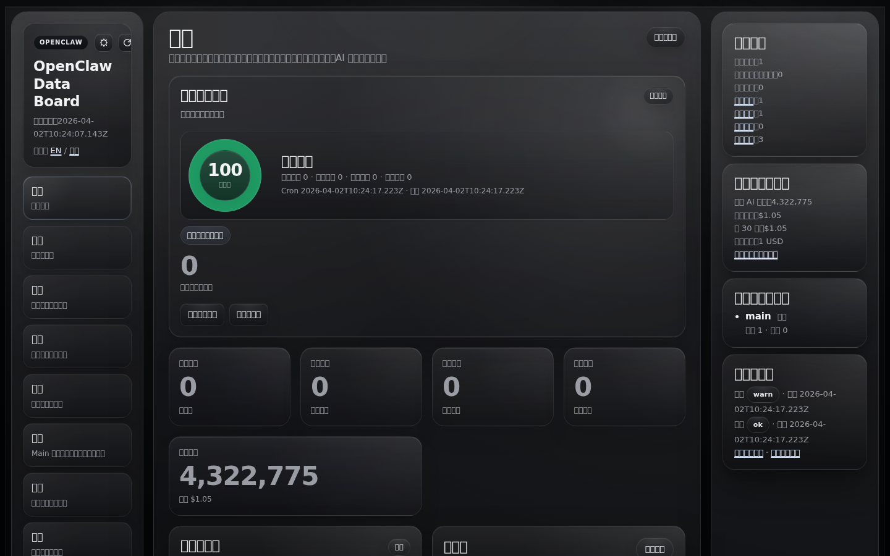
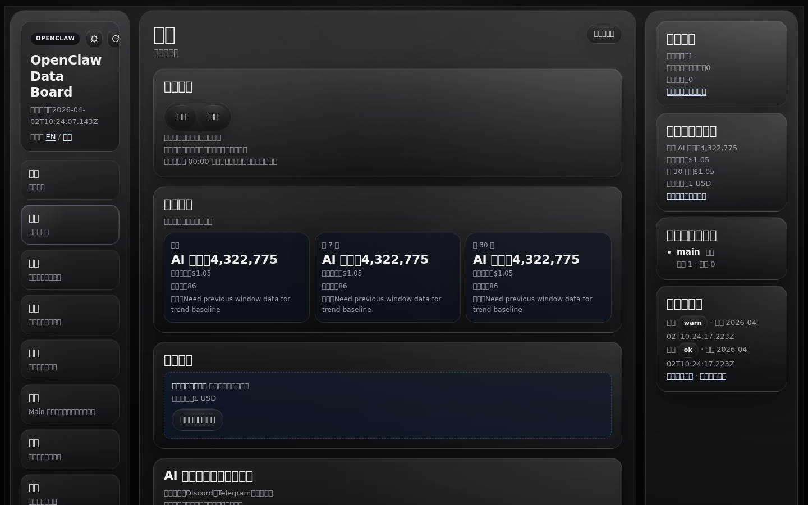
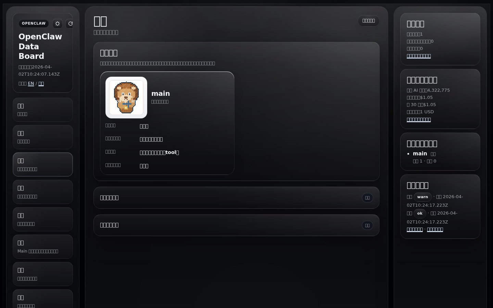
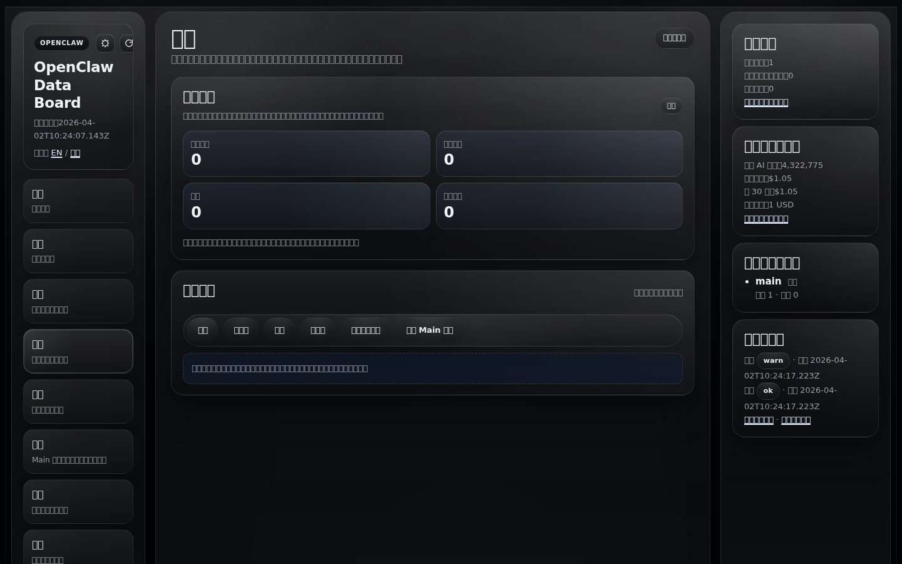
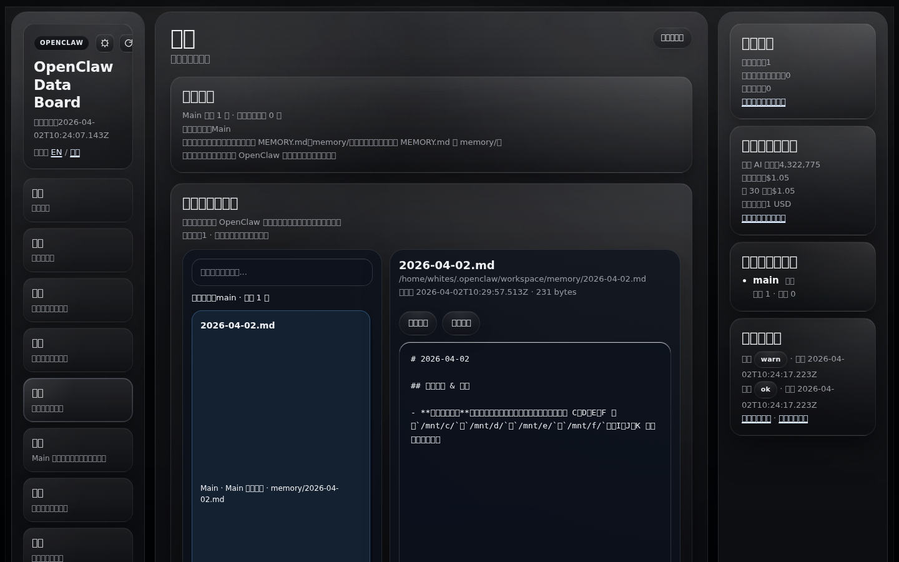
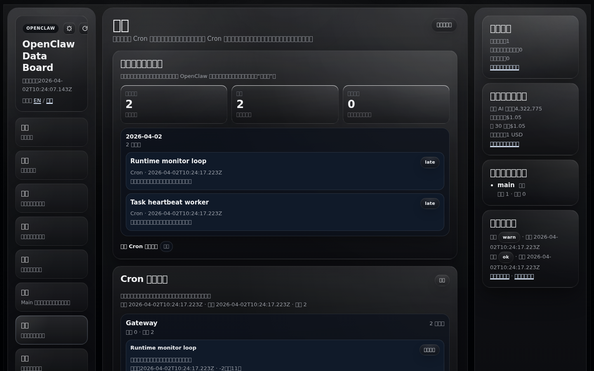
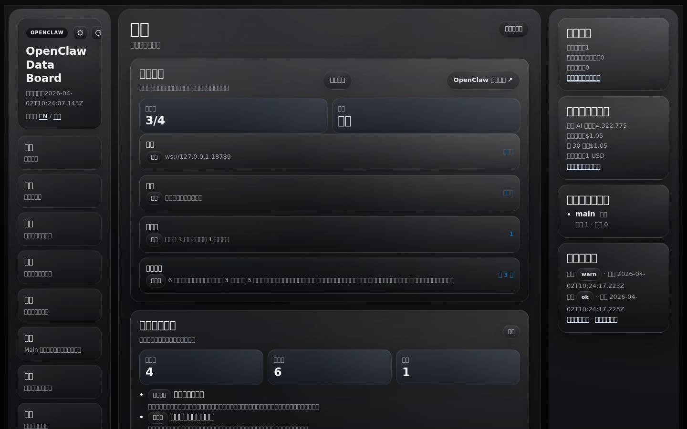
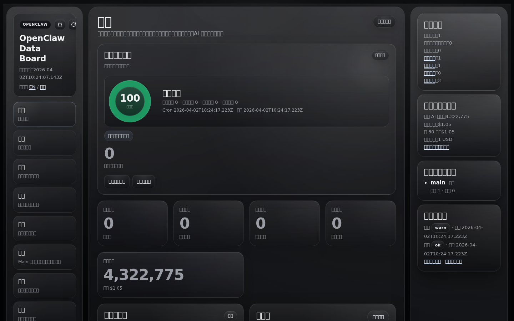

# OpenClaw Data Board

> [English](README.md) | **中文**

把 OpenClaw 从黑箱变成一个看得清、信得过、控得住的本地控制中心。

## 这是什么

一个 **本地优先的 OpenClaw 可观测性与控制中心**。它连接到正在运行的 OpenClaw Gateway，将 agent 会话、任务、用量、记忆和安全状态呈现在一个 Web UI 中——数据不会离开你的机器。

**核心价值：**
- 一个地方看清 OpenClaw 是否健康、忙碌、卡住或跑偏
- 面向需要可观测性和确定性的操作者，不是暴露原始后端 payload
- 安全优先：默认只读、本地 token 鉴权、写操作默认关闭

## 功能说明

### 📊 总览（Overview）
主操作页。集中展示系统状态、待处理事项、运行异常、停滞执行、预算风险、谁在忙、哪些地方需要优先关注。最适合快速回答：*"OpenClaw 现在正常吗？"*

### 💰 用量（Usage & Cost）
今日 / 7 天 / 30 天的用量和花费趋势。包含订阅窗口、配额消耗、用量结构（直接 vs 定时任务）、上下文压力指标和数据连接状态。最适合判断：*"消耗是不是太快了？"*

### 👥 员工（Staff / Team）
谁现在真的在工作，谁只是有排队中的任务。明确区分"正在执行"和"下一项"，避免把 backlog 误认为正在跑。Agent 身份卡片包含头像、角色、最近产出和排班状态。

### 🤝 协作（Collaboration）
父子会话接力与已验证的跨会话 agent 通信（如 `Main ⇄ Pandas`）集中展示。可以看到谁先接单、谁派给了谁、回复从哪条会话回来。

### 🧠 记忆（Memory）
基于源文件的记忆工作台，可查看和编辑每日记忆与长期记忆。范围跟随 `openclaw.json` 中的活跃 agent——已删除的 agent 不会显示。每个 agent 有记忆健康状态指示（可用 / 可搜索 / 需关注）。

### 📄 文档（Documents）
直接查看和编辑共享文档（`AGENTS.md`、`SOUL.md`、`USER.md` 等）和各 agent 的核心文件。读写操作直接作用于源文件。

### ✅ 任务（Tasks & Projects）
任务板、排期、审批、执行链和运行证据放在同一个分区。区分已计划的工作和实际执行，高亮卡住的项目，展示需要操作者介入的内容。

### 🔁 回放与审计（Replay & Audit）
操作审计时间线（导出、导入、ack 清理、任务心跳等），支持严重级别筛选。会话详情页展示完整消息历史。

### ⚙️ 设置（Settings）
接线状态卡片、安全风险摘要、更新状态和数据链路预期。明确告诉你哪些已接通、哪些还差一步、哪些高风险操作是故意关闭的。

## 截图

> 截图来自运行中的 Dashboard（`http://127.0.0.1:<PORT>/?section=<name>`）。
> 如需生成新截图，运行 `node scripts/take-screenshots.cjs`（需要 Playwright 浏览器依赖）。

| 页面 | 说明 |
|------|------|
|  | **总览** — 系统状态、会话、告警和操作摘要 |
|  | **用量** — Token 消耗、配额窗口、上下文压力 |
|  | **员工** — 活跃 Agent、最近产出、排班状态 |
|  | **协作** — 父子接力、跨会话消息 |
|  | **记忆** — 每日/长期记忆文件、记忆健康度 |
|  | **任务** — 任务板、审批、执行链 |
|  | **设置** — 接线状态、安全、更新状态 |
|  | **回放与审计** — 操作时间线、会话详情 |

## 部署约束条件

> ⚠️ **部署前必须阅读。** 以下为硬性要求，非建议。

### 运行时依赖

| 依赖 | 版本要求 | 检查命令 |
|------|---------|---------|
| **Node.js** | ≥ 22.0.0 | `node --version` |
| **npm** | ≥ 9.0.0 | `npm --version` |
| **OpenClaw CLI** | ≥ 2026.4.0 | `openclaw --version` |
| **OpenClaw Gateway** | 运行中且可连接 | `openclaw gateway status` |

### 系统要求

| 资源 | 最低要求 | 说明 |
|------|---------|------|
| **操作系统** | Linux / macOS / WSL2+Ubuntu | 未测试 Windows 原生环境 |
| **内存** | 256 MB 可用 | Node 进程 + 浏览器渲染 |
| **磁盘** | 50 MB | 源码 + 运行时产物 |
| **网络** | 仅 localhost | UI 默认绑定 `127.0.0.1` |
| **端口** | `4310`（UI）、`18789`（Gateway） | 两个端口必须可用或显式配置 |

### 安全约束（强制）

以下默认值是**故意设置**的，不理解含义请勿修改：

| 配置项 | 默认值 | 原因 |
|--------|--------|------|
| `READONLY_MODE` | `true` | 防止通过 Dashboard 进行任何写操作 |
| `LOCAL_TOKEN_AUTH_REQUIRED` | `true` | 所有受保护路由需要 `x-local-token` 头 |
| `APPROVAL_ACTIONS_ENABLED` | `false` | 审批写操作硬开关关闭 |
| `APPROVAL_ACTIONS_DRY_RUN` | `true` | 即使启用也默认 dry-run |
| `IMPORT_MUTATION_ENABLED` | `false` | 实时导入关闭 |
| `IMPORT_MUTATION_DRY_RUN` | `false` | 导入 dry-run 关闭 |
| `UI_MODE` | `false` | 必须显式设为 `true` 才会启动 Web UI |

### Dashboard 不会做的事

- ❌ **不会**修改 `~/.openclaw/openclaw.json` 或任何 OpenClaw 配置
- ❌ **不会**向外部服务发送数据
- ❌ **不会**伪造 API key、token 或凭证
- ❌ **不需要** GPT/Codex 订阅（Usage 面板优雅降级）
- ❌ **不会**假设默认 agent 名称（从运行时配置读取）

### 优雅降级

缺少某些数据源时，Dashboard 仍然运行——相关面板显示"未连接"而非崩溃：

| 缺少的数据源 | 受影响的面板 | 行为 |
|-------------|-------------|------|
| `~/.codex` | 用量、订阅 | 显示"不可用"占位 |
| 订阅快照 | 订阅卡片 | 显示连接器 TODO |
| Provider API Key | 用量数据 | 显示断开状态 |
| Live Gateway 不可达 | 所有实时数据 | 回退到缓存快照 |

## 快速开始

```bash
git clone https://github.com/young-nights/openclaw-data-board.git
cd openclaw-data-board
npm install
cp .env.example .env
npm run build
npm test
npm run smoke:ui
npm run dev:ui
```

打开：**http://127.0.0.1:4310/?section=overview&lang=zh**

### 环境变量参考

| 变量 | 默认值 | 说明 |
|------|--------|------|
| `GATEWAY_URL` | `ws://127.0.0.1:18789` | OpenClaw Gateway WebSocket 地址 |
| `UI_PORT` | `4310` | Dashboard HTTP 端口 |
| `UI_BIND_ADDRESS` | `127.0.0.1` | 绑定地址（改为 `0.0.0.0` 允许远程访问） |
| `READONLY_MODE` | `true` | 只读模式 |
| `LOCAL_TOKEN_AUTH_REQUIRED` | `true` | 受保护路由需要本地 token |
| `LOCAL_API_TOKEN` | *(空)* | 显式设置以启用受保护命令 |
| `OPENCLAW_HOME` | `~/.openclaw` | OpenClaw 主目录 |
| `OPENCLAW_CONFIG_PATH` | `~/.openclaw/openclaw.json` | 配置文件路径 |
| `OPENCLAW_WORKSPACE_ROOT` | *(自动检测)* | 工作区根目录 |
| `OPENCLAW_AGENT_ROOT` | *(自动)* | 当前 agent 工作区 |
| `CODEX_HOME` | *(可选)* | Codex/GPT 主目录 |
| `OPENCLAW_SUBSCRIPTION_SNAPSHOT_PATH` | *(可选)* | 订阅快照文件路径 |

## CLI 命令

```bash
# 备份导出
APP_COMMAND=backup-export LOCAL_API_TOKEN=<token> npm run command:backup-export

# 导入验证（dry-run）
APP_COMMAND=import-validate COMMAND_ARG=path/to/file.json LOCAL_API_TOKEN=<token> npm run command:import-validate

# 清理过期 ack
APP_COMMAND=acks-prune LOCAL_API_TOKEN=<token> npm run command:acks-prune

# 任务心跳
APP_COMMAND=task-heartbeat LOCAL_API_TOKEN=<token> npm run command:task-heartbeat
```

## 项目结构

```
src/
├── index.ts                 # 入口，CLI 命令路由
├── config.ts                # 环境变量解析
├── types.ts                 # 共享类型定义
├── adapters/
│   └── openclaw-readonly.ts # OpenClaw Gateway 只读适配器
├── clients/
│   ├── factory.ts           # Tool client 工厂
│   ├── openclaw-live-client.ts
│   └── tool-client.ts
├── mappers/
│   ├── openclaw-mappers.ts  # 会话 → 摘要映射
│   └── session-status-parser.ts
├── runtime/                 # 业务逻辑模块
│   ├── monitor.ts           # 主监控循环
│   ├── usage-cost.ts        # 用量与花费计算
│   ├── task-store.ts        # 任务 CRUD
│   ├── project-store.ts     # 项目 CRUD
│   ├── session-conversations.ts # 会话历史与执行链
│   ├── agent-roster.ts      # Agent 发现
│   ├── notification-center.ts # 动作队列与确认
│   ├── export-bundle.ts     # 备份/导出逻辑
│   ├── openclaw-cli-insights.ts # CLI 健康/安全/记忆
│   └── ...                  # 30+ 更多模块
└── ui/
    └── server.ts            # HTTP 服务器、所有路由、HTML 渲染
```

## 这不是什么

- 不是 OpenClaw 本体的替代品
- 不是面向所有 agent 技术栈的通用平台
- 不是托管式 SaaS 控制台

## 许可证

MIT
